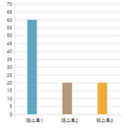

# **7. 시각화**
##  **개요**

* K-DaViF를 사용해서 차트를 생성하는 자바스크립트 코드를 반환

##  **전제조건**

* 색인 데이터 불 필요

##  **정보**

- 요청 METHOD : GET
- 요청 URL : http://[IP:PORT]/konantech/plt.do
- 호출 예시 : http://[IP:PORT]/konantech/plt.do?type=bar&width=300&height=300&data=name%2Cvalue%5Cn테스트1%2C60%5Cn테스트2%2C20%5Cn테스트3%2C20
- 파라미터

    |파라미터    |설명  |필수/선택  |
    |---------|---------|---------|
    |type     | 차트 타입 ("bar","line","pie","scatter" 등)|필수|
    |width |  차트의 가로 길이|필수|
    |height |  차트의 세로 길이|필수|
    |data |  입력 데이터|필수|

- 호출결과

